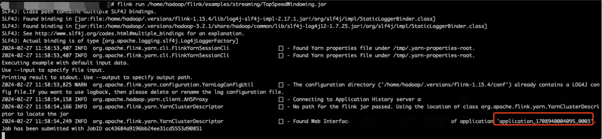
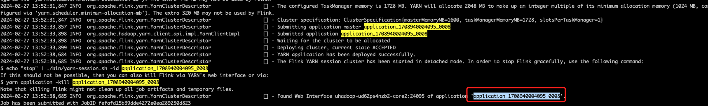
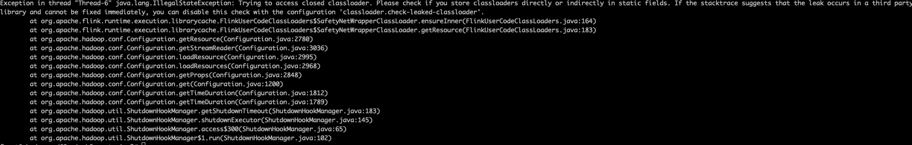
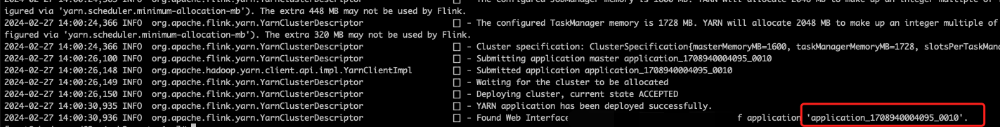
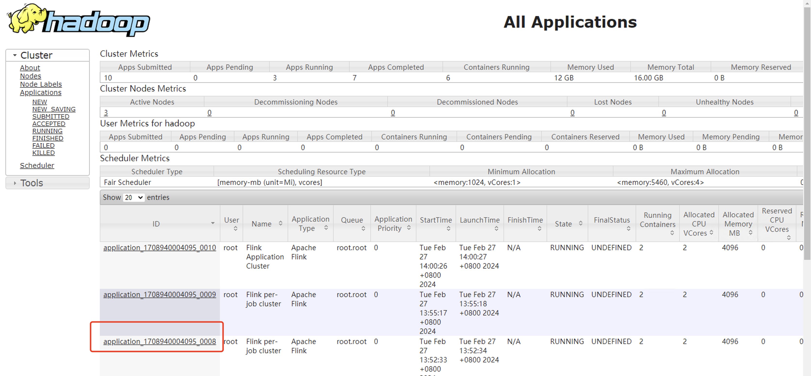
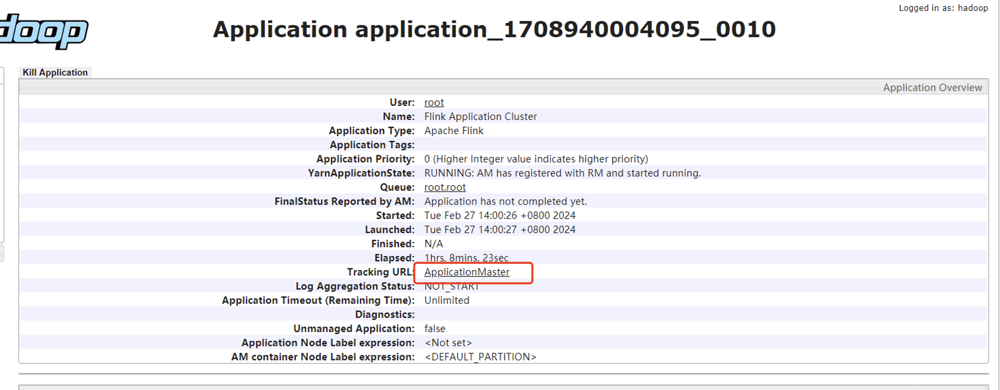
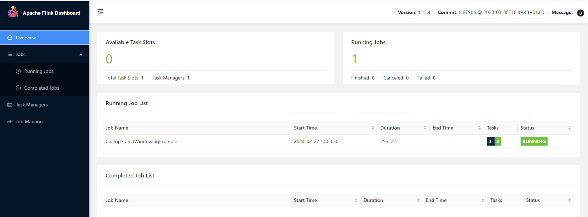
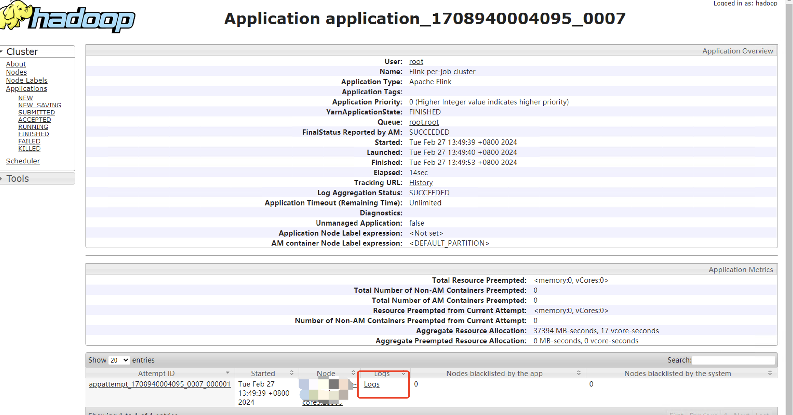
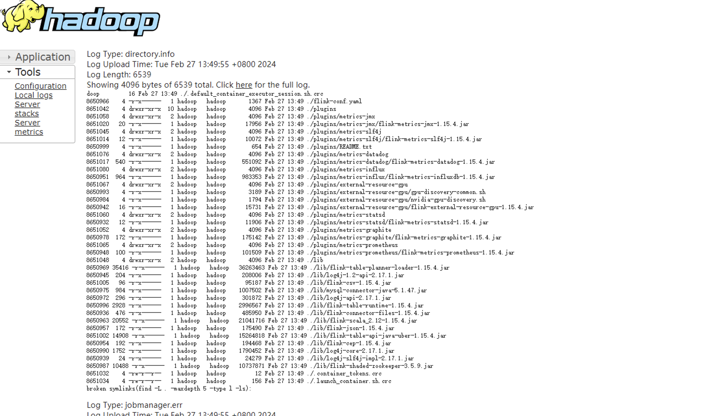

## Flink操作指南

## 1. 基本介绍

**Apache Flink** 是一个在有界数据流和无界数据流上进行有状态计算分布式处理引擎和框架。Flink 设计旨在所有常见的集群环境中运行，以*任意规模和内存级速度执行计算。详细见[Appache Flink](https://flink.apache.org/zh/)。

## 2. 提交作业模式

UHadoop中的Flink采用Flink On Yarn 模式部署，您可以SSH登陆UHadoop集群任意节点，在命令行中进行Flink作业提交。

Flink On Yarn模式提供Session、Per-Job Cluster与Application三种模式提交作业，具体说明如下：

| 模式            | 说明                                                         | 优缺点                                                       |
| --------------- | ------------------------------------------------------------ | ------------------------------------------------------------ |
| Session         | 该模式下会创建一个Flink集群，所有作业都将被提交到这个集群上运行，并且该集群在作业运行结束之后不会自动释放。如果某个作业发生异常，导致一个Task Manager关闭，则其他所有运行在该Task Manager上的作业都会失败。 | 优点：提交作业资源分配开销小 。<br/>缺点：作业之间存在资源竞争。<br/>适用场景：部署需要较短启动时间且运行时间相对较短的作业。 |
| Per-Job Cluster | 该模式每次提交一个Flink作业，YARN都会为这个作业新启动一个Flink集群，然后运行该作业。当作业运行结束或者被取消时，该作业所属的Flink集群也会被释放。 | 优点：作业之间资源隔离，一个作业的异常行为不会影响到其他作业。<br/><br/>缺点：启动作业的开销更大。<br/>适用场景：运行时间较长的作业。 |
| Application     | 该模式每次提交一个Flink Application（一个Application包含一个或多个作业），YARN都会为这个Application新启动一个Flink集群。当Application运行结束或者被取消时，该Application所属的Flink集群也会被释放。<br/>该模式与Per-Job模式不同的是，Application对应的JAR包中的main()方法会在集群中的Job Manager中被执行。<br/><br/>如果提交的JAR包中包含多个作业，则这些作业都会在该Application所属的集群中执行。 | 优点：可减轻客户端提交作业时的负担。<br/>缺点：启动作业的开销更大。<br/>适用场景：运行时间较长的作业。 |

## 3. 提交作业

前提：SSH方式登陆集群节点。

### 3.1 Session模式

* 执行以下命令，启动 yarn session

  ```
  yarn-session.sh --detached
  ```

* 执行以下命令，提交作业

  ```
  flink run /home/hadoop/flink/examples/streaming/TopSpeedWindowing.jar
  ```

  提交成功后，会返回作业对应的Yarn ApplicationId（后续步骤会使用到），如下标红字段：

  

### 3.2 Per-Job 模式

* 执行以下命令，提交作业

  ```
  flink run -t yarn-per-job --detached /home/hadoop/flink/examples/streaming/TopSpeedWindowing.jar
  ```

  提交成功后，会返回作业对应的Yarn ApplicationId（后续步骤会使用到），如下标红字段：

  

  如果提交任务出现报错：`Exception in thread "Thread-6" java.lang.IllegalStateException: Trying to access closed classloader. Please check if you store classloaders directly or indirectly in static fields. If the stacktrace suggests that the leak occurs in a third party library and cannot be fixed immediately, you can disable this check with the configuration 'classloader.check-leaked-classloader'.`

  

​       在/home/hadoop/flink/conf/flink-conf.yaml 文件中添加`classloader.check-leaked-classloader: false`重新提交任务即可。

### 3.3 Application 模式

* 执行以下命令，提交作业

  ```
  flink run-application -t yarn-application /home/hadoop/flink/examples/streaming/TopSpeedWindowing.jar
  ```

  提交成功后，会返回作业对应的Yarn ApplicationId（后续步骤会使用到），如下标红字段：

  

## 4. 作业操作

### 4.1 查看作业

* 访问Yarn WebUI，访问方式参考[UHadoop服务WebUI接入指南](developer/webui) ，如下图选择对应任务，并点击任务ID，如截图中标红区域。

  

* 进入新页面之后，单击**Tracking URL**的链接：

   

* 进入Flink 页面，可查看作业相关信息。

  

说明：已结束的作业需要通过单独的方式查看日志，具体如下：

* 访问Yarn WebUI，访问方式参考[UHadoop服务WebUI接入指南](developer/webui) ，如下图选择对应任务，并点击任务ID，如截图中标红区域。

  
  
  即可查看作业日志，如下：
  
  

### 4.2 停止作业

可执行以下命令停止作业：

```
flink cancel -t yarn-application -Dyarn.application.id=<applicationId> <jobId>
```

### 4.3 指定作业配置

可通过以下方式指定作业配置：

* 代码中指定：可在代码中直接指定配置，参考示例如下：

  ```
  // instantiate table environment
  Configuration configuration = new Configuration();
  // set low-level key-value options
  configuration.setString("table.exec.mini-batch.enabled", "true");
  configuration.setString("table.exec.mini-batch.allow-latency", "5 s");
  configuration.setString("table.exec.mini-batch.size", "5000");
  
  ...
  ```

  详细可参考[Flink配置](https://nightlies.apache.org/flink/flink-docs-release-1.15/docs/dev/table/config/)。

* 任务提交命令中设置，可以通过-D指定配置项，如下：

  ```
  flink run-application -t yarn-application -D classloader.check-leaked-classloader=false
  ```

* 修改flink配置文件/home/hadoop/flink/conf/flink-conf.yaml ，修改或者添加配置项。