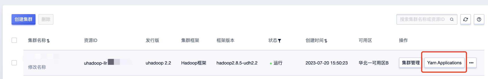
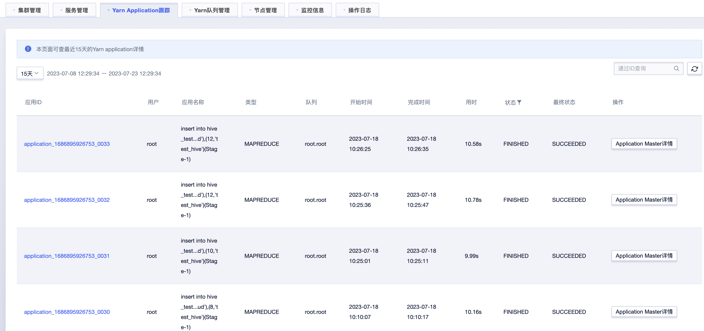
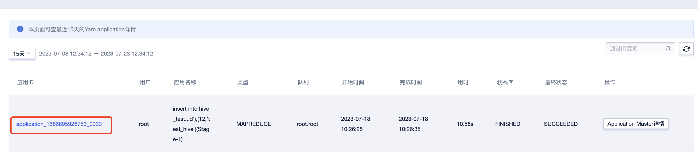
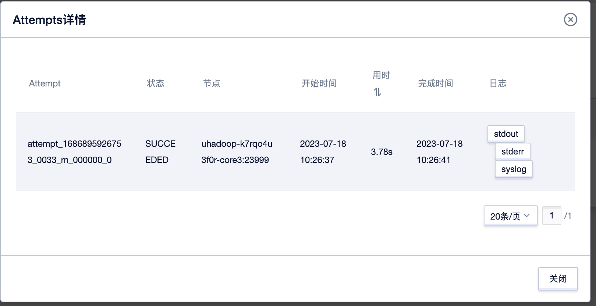
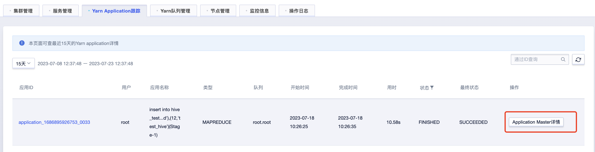
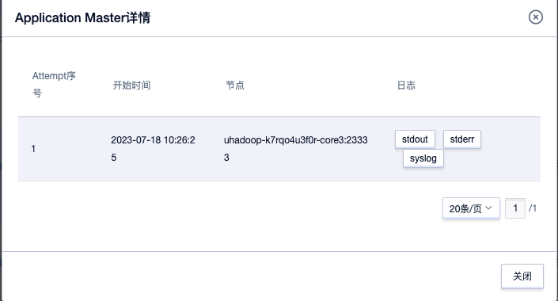

# Yarn Application 跟踪

选择需要操作实例，点击"Yarn Application"按钮可进入Yarn Application 跟踪页面，查询指定时间的Yarn Application信息。

默认展示近15天信息，可根据需要设定时间范围进行查询。

对于 MapReduce、Spark 类型 Application，可查子任务日志、以及 Application Master 日志详情。

暂不支持查看其他类型的 Application 详情。

Yarn Application 状态说明：

| 状态         | 说明                                                          |
| ---------- | ----------------------------------------------------------- |
| NEW        | Application 请求到 ID 和可用资源后，状态为 NEW                           |
| NEW SAVING | Resource Manager 接收到 Application 的详细资源请求后，状态为 NEW SAVING    |
| SUBMITTED  | Resource Manager 存储 Job 信息后，状态为 SUBMITTED                   |
| ACCEPTED   | Resource Manager 的 Scheduler 做资源、用户权限等验证，验证通过后，状态为 ACCEPTED |
| RUNNING    | 资源就绪，开始执行 Application                                       |
| FINISHED   | Job 如期执行完毕，状态为 FINISHED                                     |
| FAILED     | 执行失败                                                        |
| KILLED     | 由用户终止了 Job                                                  |

## 子任务查询

选择指定Application，点击应用ID可查询对应子任务信息如下：

点击Task信息可以获取任务运行记录信息入下：

在日志列可点击stdout、stderr或者syslog获取不同类型日志信息：

说明：只有运行结束的任务才能查询到日志。

## Application Master详情

选择指定Application，点击“Application Master详情”可查询所有任务运行记录信息如下：

在日志列可点击stdout、stderr或者syslog获取不同类型日志信息：

说明：只有运行结束的任务才能查询到日志。
yarn_application_master_page.png