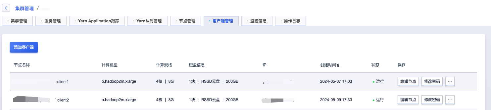
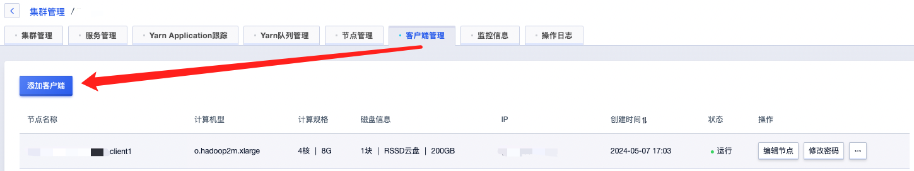
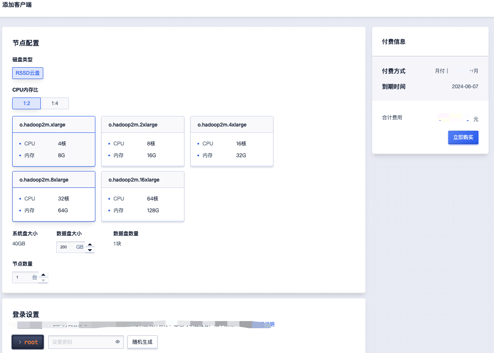
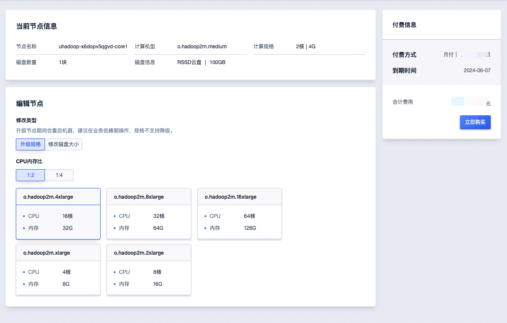
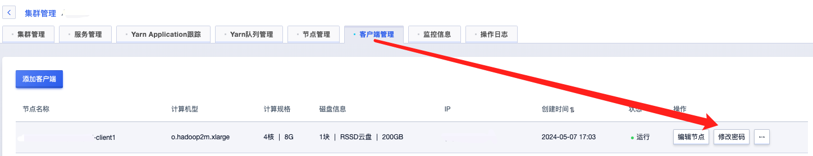
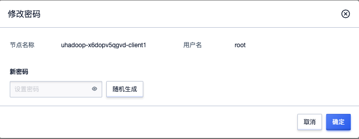
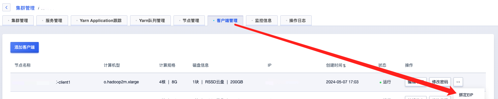
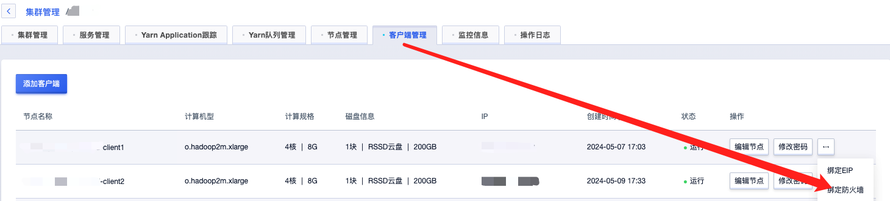
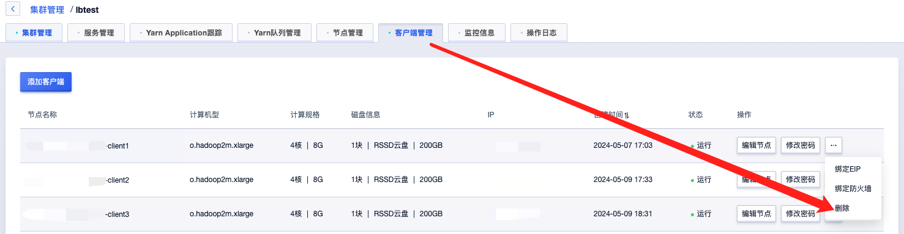

# 客户端管理

客户端节点不部署集群服务，仅部署集群相关服务客户端，包括HDFS客户端、Yarn客户端、Hive客户端、HBase客户端等，用户可通过客户端节点与集群进行交互如提交作业等，通过客户端环境与集群环境隔离保证集群服务稳定。

点击实例详情，选择“客户端管理”Tab可进入客户端管理页面。

## 客户端列表

客户端列表展示所有在用客户端实例，包括节点名称、机型、规格、磁盘信息、IP等，具体如下图：

您可以按需添加客户端或者对已有客户端进行编辑、修改密码等操作。

## 添加客户端

可点击“添加客户端”增加新的客户端实例：

可根据需要对客户端进行配置，注意事项：

* 客户端计算规格与存储在创建之后可以动态调整；
* 为保证访问安全，请勿使用弱密码。

## 编辑节点

客户端节点支持对计算规格与存储动态调整，可选择对应节点点击“编辑节点”进入升级页面：

支持升级规格与修改磁盘大小两种操作，说明如下：

\* 升级规格：修改操作节点CPU/内存配置，升级节点期间会重启机器，规格暂不⽀持降级。

\* 修改磁盘大小：修改操作节点磁盘大小，升级期间节点无需重启。

## 修改密码

客户端支持修改密码，可点击“修改密码”按钮进行操作，如下：

注意事项：

* 为保证访问安全，请不要使用弱密码；

## 绑定/解绑EIP

如您需要外网访问客户端，可点击“绑定EIP”进行绑定指定EIP，也可点击“解绑EIP“按钮关闭外网访问。

注意事项：

* 绑定EIP同时务必配置好防火墙策略（具体见下方绑定防火墙说明），以防止潜在的网络攻击。

## 绑定防火墙

客户端绑定EIP同时可通过绑定防火墙来限制客户端外网访问，以保证客户端访问安全。具体可点击”绑定防火墙“按钮进行防火墙切换。

防火墙内容修改可在[外网防火墙](https://console.ucloud.cn/unet/ufirewall)页面进行修改。

## 删除客户端

如不需要客户端实例，可点击”删除“按钮进行回收。

注意事项：

* 客户端节点端删除不可恢复，删除前请备份节点上重要数据。