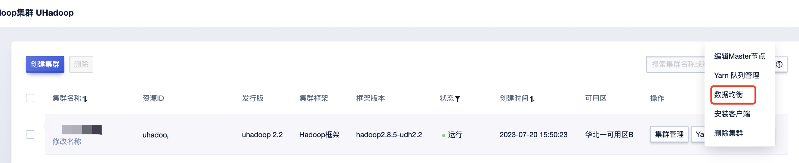
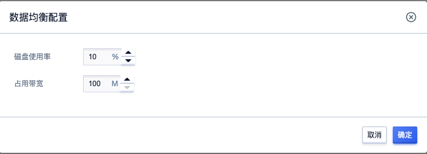

# 数据均衡

集群新加Core节点、Core节点扩容或者节点存储不均衡时，可对进群进行数据均衡操作。选择对应集群实例，点击“数据均衡”按钮进入弹框操作页面

数据均衡提供两个参数：

* 磁盘使用率：集群平衡的条件，DataNode节点磁盘使用率与集群总使用率差值，当差值大于该参数时将触发数据均衡。注意：当有应用程序对集群文件进行读写时，可能部分节点暂时达不到设置阈值。

* 占用带宽：数据迁移带宽最大值，设置过大可能会影响集群自身读写，建议按需设置。

均衡数据的过程会对集群的性能产生一定影响，持续时间根据集群内数据量以及均衡程度而不同。