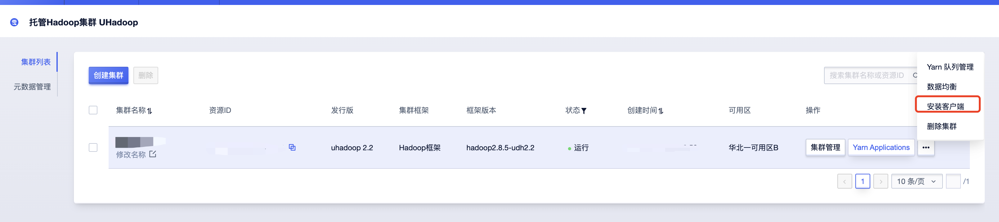

# 客户端安装

在实例列表选择需要操作实例在“操作”列中点击“安装客户端”按钮：

在“安装客户端”弹框中填写需要安装主机相关信息

* 登录名：登陆主机用户名，如root或者ubuntu；
* 登陆密码：登陆用户名对应登陆密码；
* 登陆端口：登陆端口，默认为22；

说明：
* 建议使用CentOS7+主机安装；
* 目前仅支持CentOS与Ubuntu版本安装，其中Ubuntu14.04版本暂不支持安装；
* 未支持安装版本可提工单进行安装；

