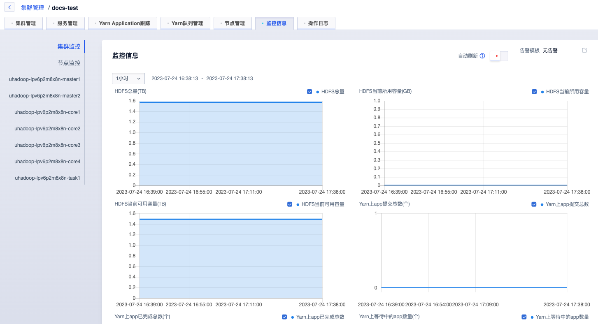
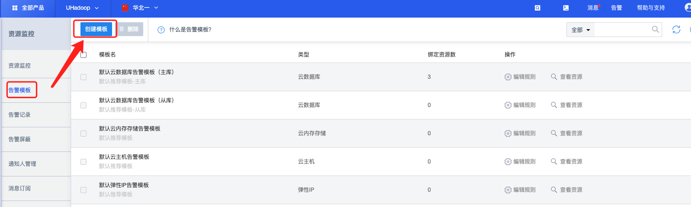
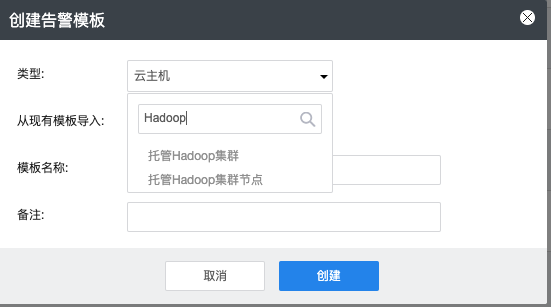
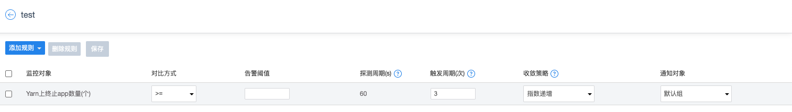
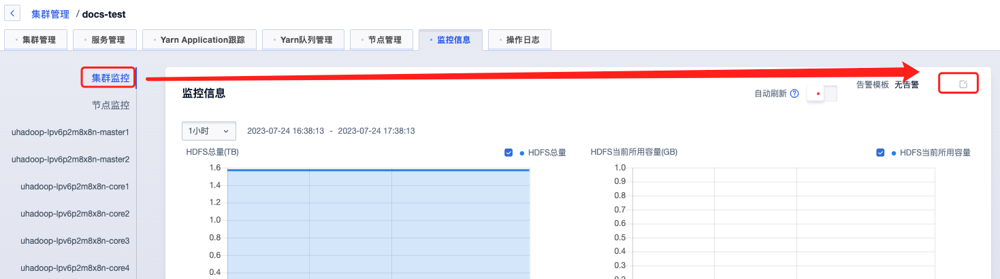

# 监控告警

## 监控查询

进入集群管理-监控信息页面可查询集群或者节点监控信息。

## 创建告警模板

进入 资源监控UMon - 告警模板：https://console.ucloud.cn/umon/template

点击“创建模板”按钮进入模板创建弹框。

弹框内“类型”选项选择“托管Hadoop集群”或者"托管Hadoop集群节点"

点击创建之后进入告警规则设置页面，可点击添加规则选择需要的指标，然后设置对应对比方式、告警阈值、触发周期、通知对象等参数完成规则创建，创建完成之后点击“保存”按钮保存规则。

## 告警模板绑定

### 集群告警模板

进入集群管理-监控信息页面，点击左侧集群监控进入集群监控页面，然后点击右上角告警模板按钮进行告警模板绑定。

### 节点告警模板

进入集群管理-监控信息页面，点击左节点名称进入节点监控页面，然后点击右上角告警模板按钮进行告警模板绑定。