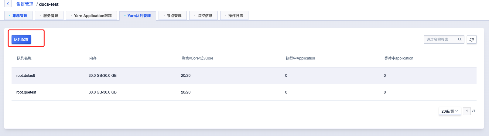

# 队列

在集群管理-Yarn队列管理页面可查看Yarn队列并进行管理：

点击“队列配置”按钮可进行创建、修改、删除队列操作。

## 创建队列：

进入队列配置页面后，点击“创建队列”进入创建队列页面：

队列名称要求只能输入字母或者数字，且首位只能输入字母，确定后会提供队列默认配置，在队列配置中可进行修改，信息确认之后点击确认按钮进行生效。

## 修改队列

可在队列配置页面按需修改指定队列配置，信息确认之后点击确认按钮进行生效。

## 删除队列

可在队列配置页面选择指定队列并点击，信息确认之后点击确认按钮进行生效。

说明：首次配置队列或者删除队列时，将会重启yarn的ResourceManager服务。