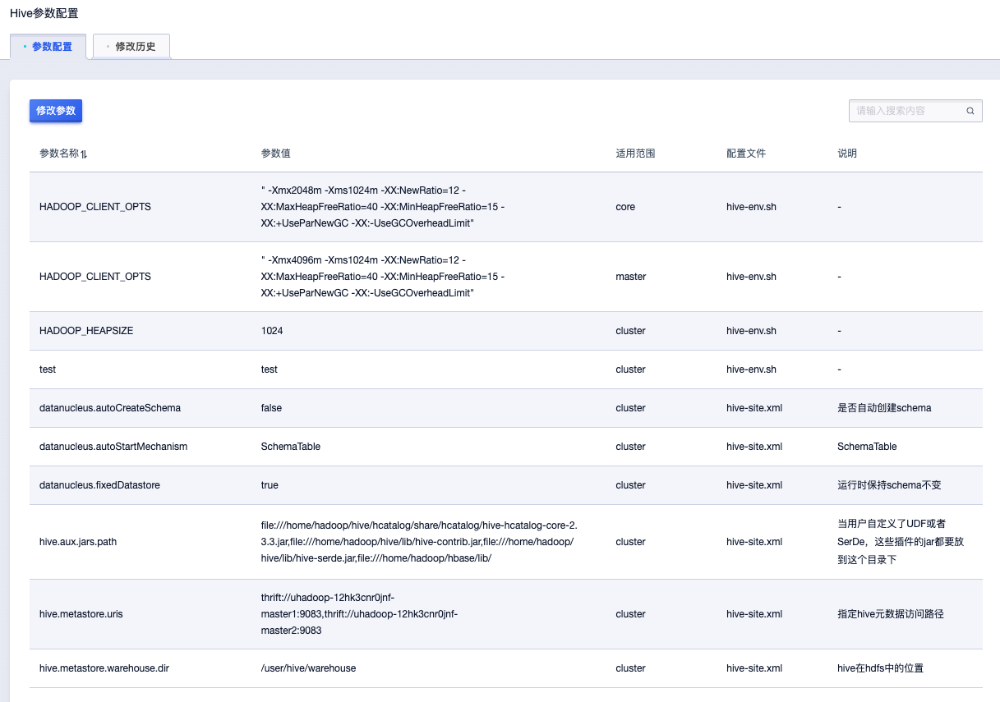

# 服务管理

进入集群管理-服务管理页面，可查询集群运行服务列表并进行服务管理。

## 开启服务

针对集群未安装或者已关闭的服务，可点击“开启服务”按钮进行安装或者开启。

## 关闭服务

针对集群中需要暂停或者不使用的服务，可点击“关闭服务”按钮进行关闭。

## 重启服务

在服务异常或者修改参数之后需要生效等场景，可点击“重启服务”进行处理。

## 参数配置

点击服务列表指定服务“参数配置”按钮可对服务参数进行管理，包括“参数配置”与“修改历史”两部分。

### 参数配置

点击“修改参数”可对服务参数进行修改

参数修改包括：

* 新增参数：点击“新增参数“按钮增加新的参数
   
   * 参数名称：新增参数名称
   * 使用范围：包括cluster、task、core、master，可按需选择
   * 文件：根据实际情况选择参数所属配置文件
   * 参数值：需要设置参数实际值
* 修改参数：修改已有参数值
* 删除参数：点击参数右侧“删除”按钮删除对应参数

在执行上述操作之后，点击“确定”按钮进入“修改项确认”弹框如下:

参数修改需要重启服务才可生效，根据需要可选择立即重启服务，或者稍后进行手动重启服务。

### 修改历史

可在“修改历史”页面查看历史修改记录，如下：

点击“详情”按钮可查看单次配置修改详细信息。

